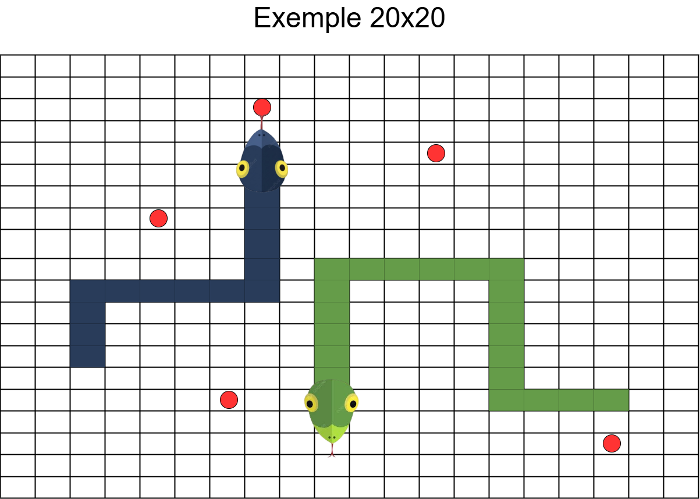

# 🎮 MegaWorm

> Imitation de **Slither.io** — un snake multi-joueurs compétitif

---
# 🎯 Objectifs

- Tenir le plus longtemps possible  
- Devenir le plus grand serpent  
- Tuer d'autres serpents  

---

# Lancer le jeu

1. installer les dépendances
```shell
pip install -r requirements.txt
```

2. Lancer MegaWorm
```shell
python src/main.py
```

----

# Modélisation de MegaWorm

### 🌍 Environnement

- **Taille de la carte** : `1024 x 1024` cases  
- **Orbes** :
	- Position: `(X, Y)`
	- Valeur: `10` → `50`
- **Bords** : délimitent la map

---
### 🐍 Etat (serpent)

- **Longueur** (*en nombre de case*) : `L`  (0 → 1024)
- **Position** (*de la queue à la tête*) : `[ (X0, Y0), ..., (XL, YL) ]`

---
### 🎮 Actions

- ``U | D | R | L`` (*limité aux 4 déplacements cardinales pour la 1ère phase*)

---
### ⚙️ Mécaniques

- **Apparition des orbes**
	- aléatoirement
		→ Règle dépend du nombre d'orbe déjà présentes & du temps
	- à la mort d'un serpent
- **Mort du serpent** si collision de sa tête avec
	- bord de la map
	- autre serpent
- **Augmentation de la taille du serpent** lorsqu'il collecte une orbe

---
### 🏆 Récompenses

- Temps passé sans mourir
	- `T x 1` (T = temps en seconde)
- Orbes récoltées = valeur de l'orbre
- Joueurs tués (peut rendre les serpents agressifs 😈)
	- `100`
	- ou `S / 1000 * 100` (S = Taille serpent tué)
		→ Pour que le bas peuple se rebelle contre l'élite

---



---

# Futures améliorations

L’objectif de cette deuxième phase est de faire évoluer **MegaWorm** d’un environnement **discret et quadrillé**
vers un environnement **continu et fluide**, pour se rapprocher davantage du gameplay de *Slither.io*.

### 1️⃣ Déplacements libres à 360°
   - Les positions cardinales (`U | D | L | R`) disparaissent au profit d’un **mouvement angulaire continu**
        → La rotation du serpent dépend de la direction du curseur contrôlé par le joueur.
   - La direction d'un serpent est donnée par un vecteur `v = (dx, dy)`
   - Les positions deviennent des coordonnées **flottantes** ``position = (float x, float y)``
   - A chaque tick: ``nouvelle_position = position_actuelle + v * vitesse``

### 2️⃣ Monde continu et formes courbes
- L’environnement n’est plus basé sur une grille de cases 1024×1024 mais sur un **plan continu**.
- Les éléments du jeu (serpents, orbes, bordures) seront représentés par des **formes géométriques continues** :
  - **Serpent** → chaîne de cercles ou segments reliés pour former une courbe fluide.  
  - **Orbes** → points colorés avec rayon défini (au lieu d’occuper une case).  
  - **Collisions** → calculées à partir de **distances** (entre centres des cercles) plutôt que de coordonnées discrètes.

→ Ce passage à la continuité permettra :
- Un **mouvement plus naturel et fluide**.
- Des **formes courbes** (au lieu des lignes brisées).
- Une **meilleure précision des collisions**.

### 3️⃣ Accélération
- Ajout d’une fonctionnalité d’**accélération temporaire** :
  - Augmente la vitesse du serpent d’un facteur `α > 1`.
  - Consomme une ressource : la taille.
- But : créer un gameplay plus stratégique et dynamique (fuite, attaque, esquive).